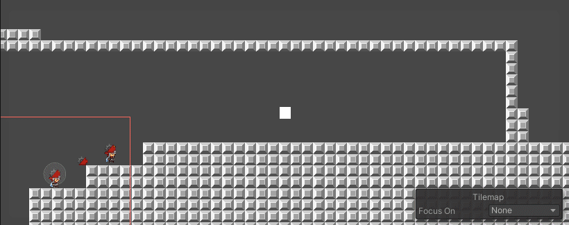
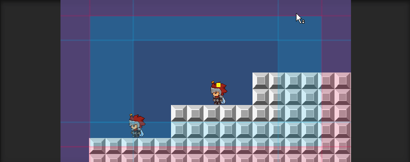
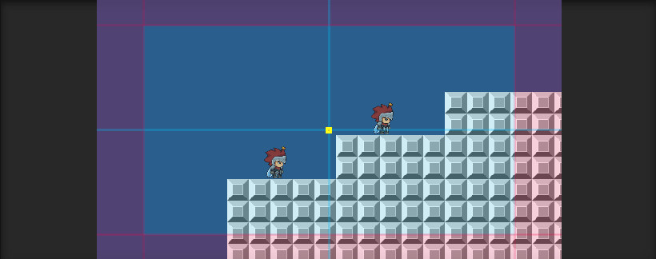
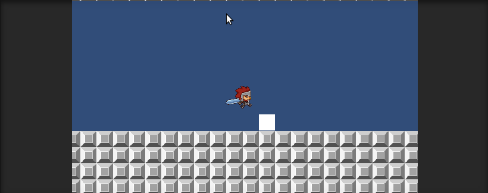
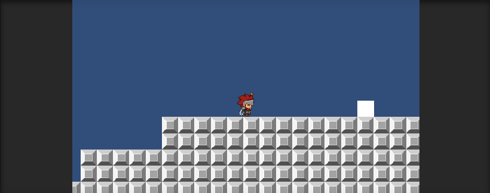
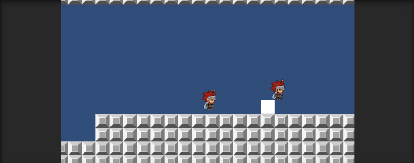
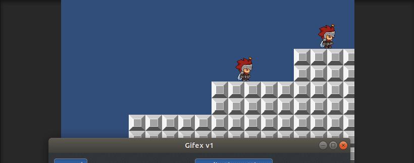

# Cinemachine

 

## Scripts

 

### Script PlayerMovement.cs

Script utilizado para configurar los controles del personaje. Utilizado en anteriores prácticas.

 

### Script changeCamera.cs

Script utilizado cambiar la cámara en el juego y para hacerla vibrar dependiendo de la tecla que se pulse:

 - Alpha1: Cámara del personaje A.
 - Alpha2: Cámara del personaje B.
 - Alpha3: Cámara de ambos personajes.
 - LeftMouseButton: Hace vibrar la cámara con una amplitud de 5 y frecuencia de 6 durante 1 segundo.

 

## Ejercicios

 

### Cámara con seguimiento al personaje A. Se debe configurar el seguimiento hacia adelante. Esta cámara es la que debe tener la máxima prioridad.

 

### Cámara con seguimiento al personaje B. Debe configurarse una zona de seguimiento del personaje B más amplia que la de A.

 

### Cámara que hace el seguimiento de ambos personajes.

 

### Crear una zona de confinamiento de A que abarque toda la escena.

 

### Se debe crear una zona de confinamiento de la cámara B que abarque una parte de la escena.

 

### Añadir un objeto que genere una vibración en la cámara cuando A choca con el.

 

### Seleccionar un conjunto de teclas que permitan hacer el cambio de la cámara de los personajes a la cámara que sigue al grupo.

 

### Generar una vibración en la cámara cada vez que se pulse la tecla de disparo. Agregar un perfil de ruido a la cámara, y modificar las propiedades de amplitud y frecuencia al component Noise.

 
