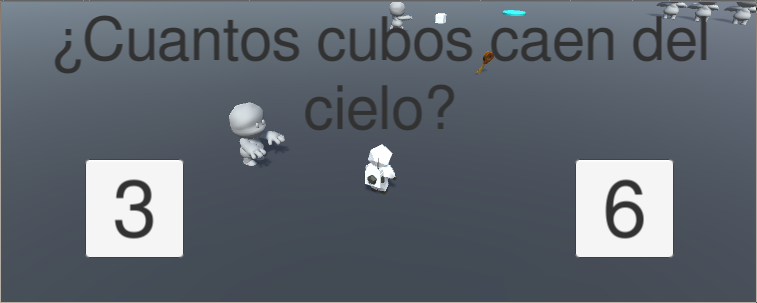

# Eventos y movimiento rectilineo.

 

## Script PlayerController.cs

Script que permite el movimiento a través de las físicas del personaje principal, además de cambiar entre sus dos animaciones "idle" y "movimiento". Cuando el personaje se encuentre en contacto con la llave y pulse el botón "E", activará a través de un evento a 3 momias y estas le perseguirán. Por último, estará a la escucha del evento de teletransporte, una vez se active, se teletransportara a la ubicación pasada.

 

## Script MummyMovement.cs

Script utilizado para el movimiento de las momias activas desde el comienzo. Estas se girarán hacia su objetivo especificado y se moverán hacia adelante, hasta estar a 7 unidades. El objetivo puede ser desde el personaje principal hasta un objeto estático.

 

## Script TP.cs

Script asociado a 2 GameObjects cilíndricos en la escena. El script almacena a los dos teletransportadores en un vector y cuando el jugador entra en contacto con uno de ellos, se envía un evento y se manda la ubicación del teletransportador más lejano. Como se explicó antes en el primer script, el personaje principal al recibir el evento, se teletransporta a la ubicación pasada.

 

## Script ActivateMummy.cs

Como bien se explico antes, el usuario al pulsar la "E" cuando está en contacto con la llave, envia un evento. Dicho evento esta a la espera en este script, y una vez es activado activará el movimiento de 3 momias que principalmente estaban inactivas hacia el usuario.

 

## Script CanvasScript.cs

Este script esta asociado al canvas, el cual esta constituido por un texto y 2 botones, dependiendo de que botón pulse el usuario, mandará un evento con un valor u otro y eliminará la intefaz UI.

 

## Script Listener.cs

Dependiendo del botón pulsado anteriormente, activará una lluvia de 3 o de 6 cubos (Los hará aparecer a 30 unidades de altura).

 
