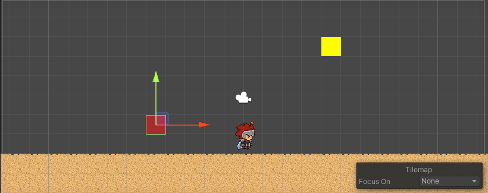
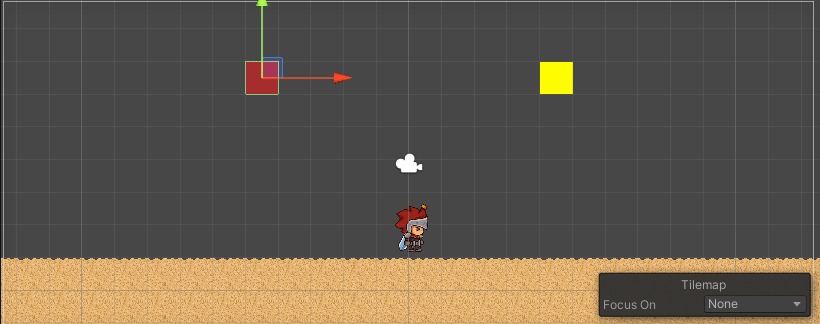
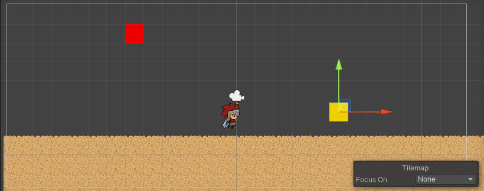
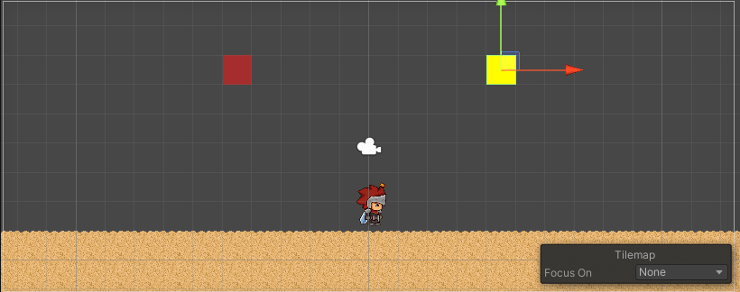
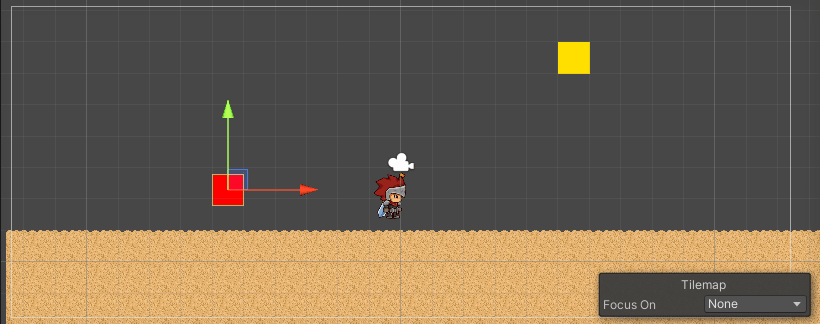
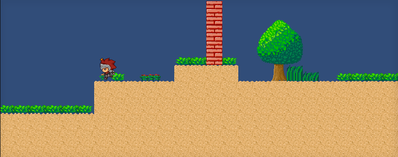
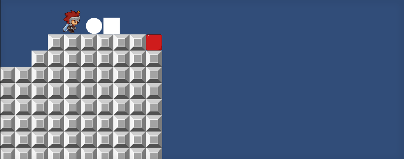
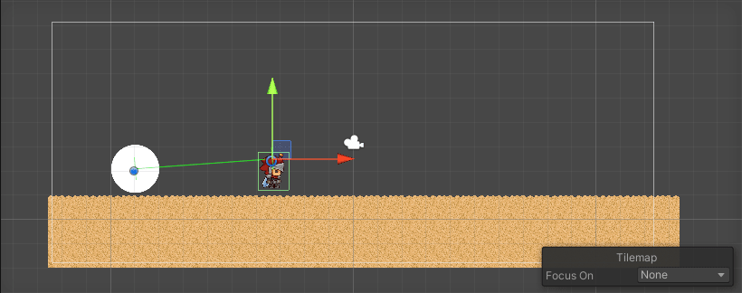
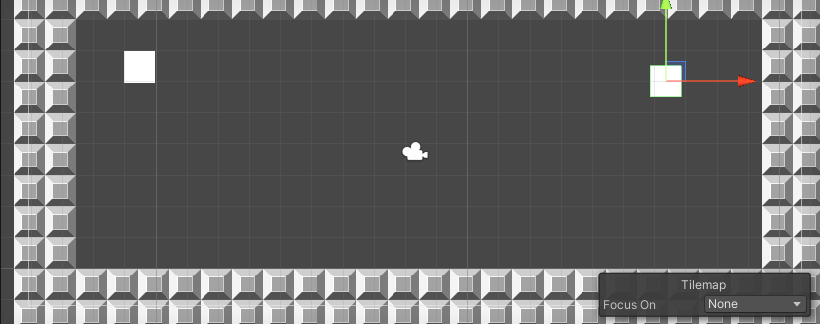
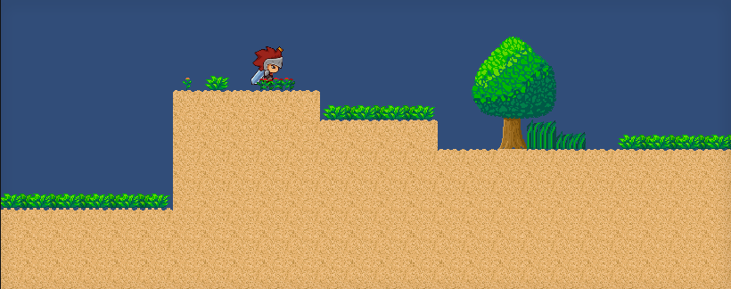

# Introducción a la programación de juegos 2D. Mapa - Físicas

Para esta práctica se han creado varias escenas para realizar los apartados. Primero se explicarán los Scripts utilizados y después se mostrarán los resultados obtenidos en cada índice.

 

## Scripts

 

### PlayerMovement.cs

Script utilizado para la asignación del movimiento y enlazado con sus respectivas animaciones del personaje principal. El código es similar al de la semana pasada.

 

### ScriptColosiones.cs

Script que detectará cualquier colisión y mostrará un mensaje por la consola.

 

### Script1\_5.cs

Script que detectará cualquier "trigger" y mostrará un mensaje por la consola.

 

### Lanzadera.cs

Script utilizado para que a cualquier objecto con físicas que atraviese el GameObject que contiene este script, se le aplique una fuerza hacia la derecha.

### Force.cs

Script el cual aplica una fuerza a un GameObject una vez hacia la derecha o izquierda.

 

## Apartados

### 1.1 Ninguno de los objetos será físico.

 

### 1.2 Un objeto tiene físicas y el otro no.

 

### 1.3 Ambos objetos tienen físicas.

 

### 1.4 Ambos objetos tienen físcas y uno de ellos tiene 10 veces más masa que el otro.

 

### 1.5 Un objeto tiene físicas y el otro es IsTrigger.

 

### 1.6 Ambos objetos son físicos y uno de ellos está marcado como IsTrigger.

 

### 1.7 Uno de los objetos es cinemático.

 

### 3.1 Objeto estático que ejerce de barrera infranqueable.

 

### 3.2 Zona en la que los objetos que caen en ella son impulsados hacia adelante.

 

### 3.3 Objeto que es arrastrado por otro a una distancia fija.

 

### 3.4 Objeto que al colisionar con otros sigue un comportamiento totalmente físico.

 

### 3.5 Incluye dos capas que asignes a diferentes tipos de objetos y que permita evitar colisiones entre ellos.

 

