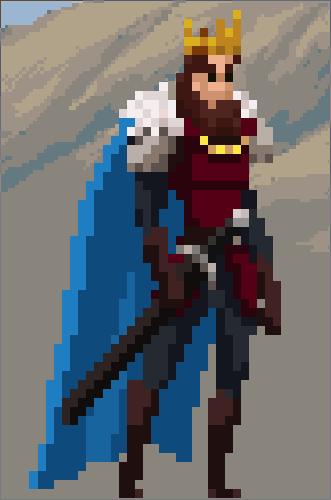
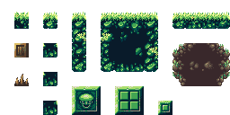
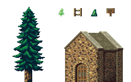
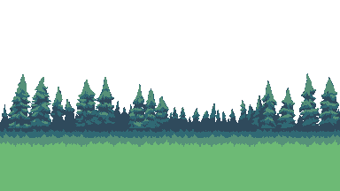
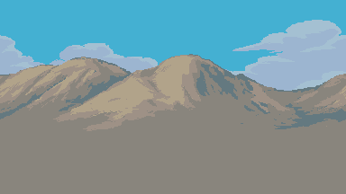

# Prototipo juego 2D.

Para acceder al github del proyecto y descargarlo, hagan clic [Aquí](https://github.com/Gandares/King-s-Adventure).

 

## Idea general

La idea general del juego fue realizar uno de plataformas en el cual el usuario tenga los movimientos básicos y una animación de ataque. Primero se buscó un sprite para el personaje principal que tuviera varios tipos de animaciones y despues un varios tilemap que combinen entre si para crear el nivel.

El sprite ganador fue:

Y los tilemaps usados fueron los siguientes:

A partir de los tilemaps seleccionados, se pensó en una ambientación de monte y montaña con dos secciones. La primera escalando la montaña con algún objetivo, y la segunda, dentro de una cueva.

Al personaje principal se le asignó el script PlayerController.cs.

 

## PlayerController.cs

Contiene todo lo relacionado con el movimiento y las acciones del personaje. Controlará las animaciones, emitirá los eventos establecidos y activará o realizará acciones cuando esté en contacto con ciertos objectos como puertas o carteles en la escena.

La animación de ataque fue dificil de unir a las demás animaciones, y se tuvo que utilizar un Script heredado de la máquina de estados.

 

## StopAttack.cs

Para controlar el fin de la animación de ataque, dado que solo queremos que se ejecute una vez. Se creó este script con el fin de cambiar la variable que controla la animacion de ataque a false cuando pase el tiempo exacto de la animación.

 

En el diseño del nivel, se colocó unas cajas que bloqueaban el camino a la segunda sección, y solamente se podían atravesar cuando el jugador consiguiera la espada. La cual estaría en el punto mas elevado de la montaña, dentro de un santuario, así concluiría la primera sección. Se colocó un tesoro que contendría la espada.

 

## Treasure.cs

Este script estará a la espera de un evento, el cual se emitirá desde PlayerController.cs cuando el usuario pulse la E estando al lado del cofre. Al recibir el evento, se cambiará el sprite del cofre y se le mandara un evento al PlayerController.cs para permitirle atacar.

 

## Box.cs

Una vez desbloqueado el ataque, atacar las cajas las rompera, estarán pendientes de si el usuario pulsa la acción. Cuando sean atacadas, estas desaparecerán y colocarán particulas, de trozos simulando que fue destruida.

 

El Gameplay se sintió como que faltaba algún tipo de mecánica extra para darle más variedad, así que se crearon las plataformas con movimiento.

 

## MovingPlatform.cs

Script que al asignarsele a un sprite, este se moverá de lado a lado, o verticalmente, durante un tiempo a una cierta velocidad, todo esto configurable. Una cosa a tener en cuenta, es que las físicas del movimiento de la plataforma tiene que heredarlas el jugador, para que este se mueva junto con la plataforma.

 

Una vez creado todo el escenario, se le dio importancia al fondo, se descargaron 2 que pudieran pegar con la escena:

Estos dos son visibles solo en la primera sección, dado que la segunda es una cueva.

 

## ParallaxController.cs

Aplica el efecto parallax a los dos fondos mencionados anteriormente.

 

## Menu.cs

Ya por último se creó un menú en una escena distinta con dos opciones, **PLAY** y **EXIT**. Al darle a **PLAY** cargará la escena que contiene el juego y al darle al **EXIT**, saldrá del juego.

 

## FinalScreen.cs

Cuando el jugador llega al final del nivel, muestra una escena en la que solamente pone **Fin del prototipo** y después de 7 segundos lo manda al menú principal.

 

Clic en el reproductor de abajo para acceder al vídeo.

