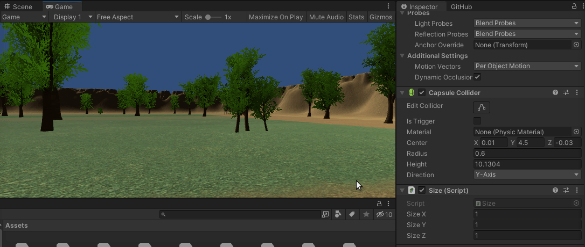
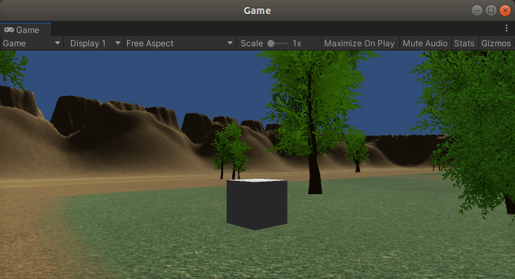
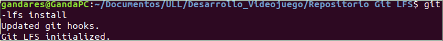
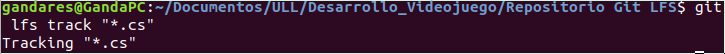
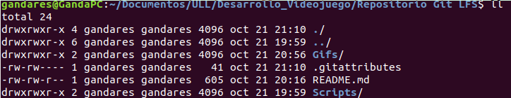
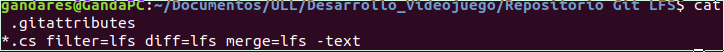

# Repositorio Git LFS
 

## Script size.cs

Script realizado para cambiar las escalas del tamaño en los 3 ejes del objeto al que se le asigne. Se podrán cambiar mientras se está ejecutando el juego dado que son 3 variables públicas.

 

## Script changeColour.cs

Script realizado para que el GameObject al que se le asigne, al ser tocado, cambie de color a rojo.

 

## Git LFS

Primero se inicializa Git LFS en el repositorio de la práctica.

Se le hace seguimiento a todo archivo acabado con la extension ".cs".

Se puede observar que ya se creo el archivo ".gitattribute".

Ahora se podrá observar el contenido de dicho archivo.

