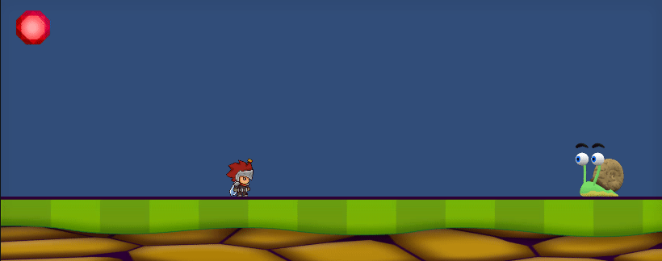

# Sprites

 

# Script PlayerMovement.cs

Script utilizado para configurar los controles del personaje:

	- A, Flecha izquierda: Movimiento hacia la izquierda.
	- D, Flecha Derecha: Movimiento hacia la derecha.
	- Espacio: Salto.
	- X: Emitir un evento para que la gema gire (Volver a pulsar para parar).

El "Flip" pedido al pulsar el botón de espacio, fue colocado en los controles de movimiento de la derecha e izquierda, y harán que el personaje gire a donde se esté moviendo.

El personaje contiene 3 animaciones: Idle, Correr y Saltar.

Por último, al acercarse al caracol a mas de 7 unidades, se emitirá un evento para que se esconda dentro de su concha (cambie la animación).

 

# Script SnailAnimation.cs

Script utilizado para el manejo del evento emitido por el "Player" cuando se acerque lo suficiente. Simplemente modifica una variable para que el "animator" cambie de animación.

 

# Script GemAnimation.cs 

Script que sigue la misma mecánica que el anterior, cambiará el valor de una variable cada vez que el jugador pulse la tecla X y así cambiar de animación.

 
