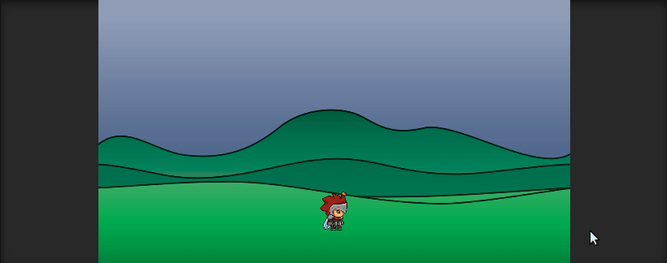

# Técnicas.

 

## Script PlayerControllerEj1.cs

Script que permite el movimiento del personaje. En este caso, el personaje estará quiero en el sitio con una animación de "Correr" y tiene la posibilidad de saltar para esquivar una serie de enemigos que van apareciendo. Si este colisiona con uno de los enemigos, se deshabilitará el mismo y emitirá un evento que recibirán los enemigos, el fondo y el generador "pooling" de enemigos. Este evento tratará de congelar todo lo que se encuentre en pantalla.

 

## Script staticCamScrolling.cs

Script que genera el movimiento del background para dar la sensación de que el personaje esta corriendo. Cuando este recibe el evento emitido por el script anterior, la velocidad de movimiento del fondo pasa a valer 0.

 

## Script pooling.cs

Existen 4 enemigos en la pantalla pero deshabilitados (SetActive(false)). Este script contiene esos enemigos e irá habilitandolos y colocandolos a alturas aleatorias cada 1.5 segundos. Lo hará en orden y cuando acabe el array, lo volverá a repetir. Cuando reciba el evento emitido por PlayerControllerEj1.cs, dejará de traer enemigos.

 

## Script enemy.cs

Este script aplicará un movimiento rectilíneo hacia la izquierda a cada uno de los enemigos colocados por el script anterior. Cuando colisiona con un objeto ubicado detrás de la pantalla de juego, se deshabilitará él mismo. Cuando reciba el evento de PlayerControllerEj1.cs La velocidad de movimiento pasará a ser 0.

 

En el gif se puede observar el juego creado y el efecto causado cuando el jugador pierde la partida.

 

En este se puede observar como se van generando los enemigos, deshabilitando cuando chocan con el cuadrado de detrás y como van atravesando la escena.

 

## Script PlayerMovementEj2.cs

Script que permite el movimiento del personaje. En este caso, el personaje correrá hacia la derecha siempre sin parar, y podrá saltar. A su vez, tiene implementada la funcionalidad de colocar los fondos 1 detrás del otro para dar la sensación de continuidad infinita. Lo único que hace es saber la anchura del fondo, y cuando vaya por la mitad del segundo fondo, coloca el primero detrás del segundo, y así indefinidamente.

 

 

## Script PlayerMovementEj3.cs

Script que permite el movimiento del personaje. En este caso, el usuario tiene completo control sobre él. Puede moverse a izquierda o derecha, quedarse quieto y saltar. Cada vez que se mueva en una dirección o se quede quieto, emitirá un evento que lo recibirá los 3 fondos. Este evento contiene 3 variables, las cuales son las velocidades a las que se moveran cada uno de los 3 fondos.

## Script moveBackground.cs

Script parecido al staticCamScrolling, pero controllando 3 fondos. El valor inicial de sus velocidades es de 0, dado que el usuario empieza quieto, si se mueve a la derecha, recibiran 3 velocidades distintas positivas, si se mueve a la izquierda, lo mismo pero negativas, y si se queda quieto las velocidades recibidas son de 0.

 

Al moverse los fondos a 3 velocidades distintas genera una sensación de profundidad.

 
