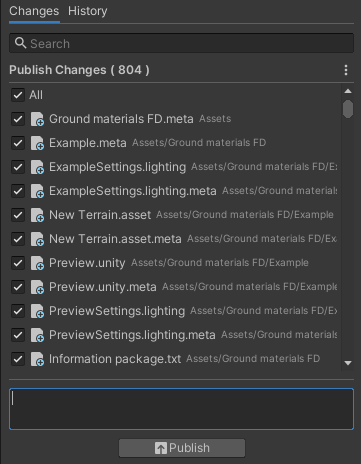

# Unity Collab

 

Primero se accede al proyecto de unity y se hace "click" en la "Window/Collaborate", esto abrirá una ventana.

Se debe crear un ID, o seleccionar uno ya creado, en mi caso escogí mi propio ID ya existente "Gandares".

Una vez ya comenzado, se crea en el historial la primera publicación con todos los cambios de los archivos.

Ahora cada vez que se realice algún cambio en el proyecto, desde la otra ventana es posible publicar los cambios, de esta manera todos los integrantes podrán sincronizar el proyecto estén donde estén. Una herramienta muy similar a Github pero integrada en Unity.

