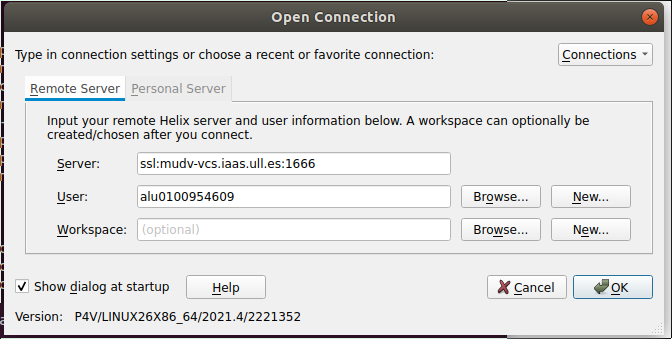
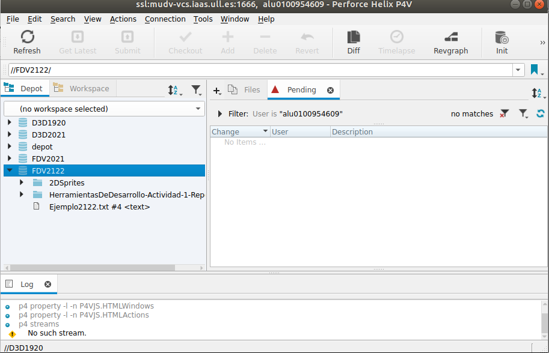
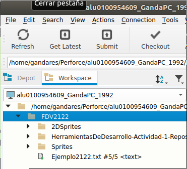
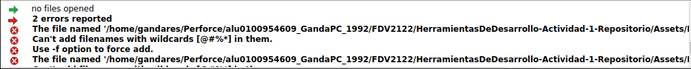
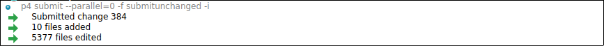
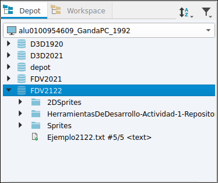

# Unity Perforce

 

El objetivo de la actividad es subir alguna de las prácticas con la herramienta perforce al **Depot FDV2122**.

Primero, en la interfaz gráfica, nos conectamos con **nuestra cuenta alu de la universidad** y al servidor **ssl:mudv-vcs.iaas.ull.es:1666**.

Una vez conectado desde la red de la universidad, se puede ver el siguiente menú:

En la ventana "Depot" se pueden ver todos los repositorios existentes en el servidor y los datos contenidos por cada uno.

En la ventana "Workspace" creamos un espacio de trabajo en local en nuestro ordenador, se crea por defecto en **~/perforce**, y allí realizamos un "Get Latest" para traernos todo el conenido del repo. Después añadimos en el espacio de trabajo local el archivo que queremos subir y se podrá ver en la interfaz que se añadió.

Le damos a "Add".

El error de la imagen se debe a que uno de los archivos traídos del repo contiene caracteres no aceptados a no ser que por línea de comandos se fuerce el comando. Pero como esos archivos ya están subidos no hay problema. De los que se van a subir, ninguno da problemas.

Por último se sube los cambios al servidor con el botón "Submit".

Ahora ya se puede ver en el servidor como está subido.

